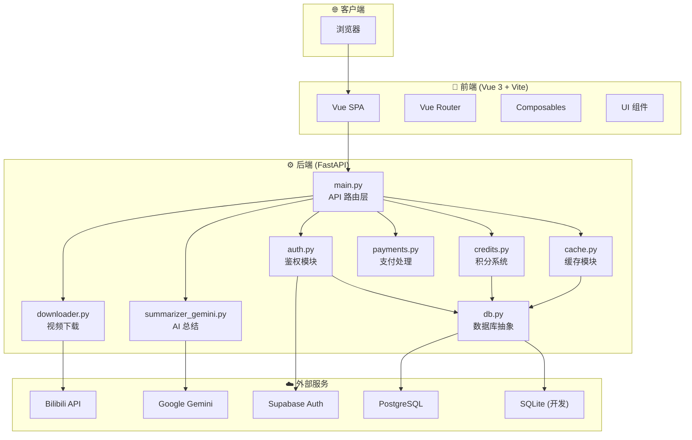
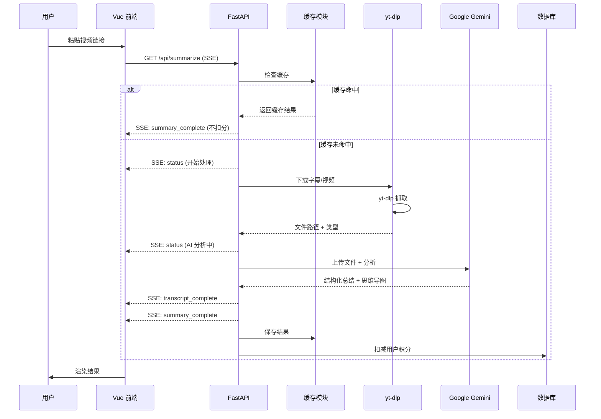
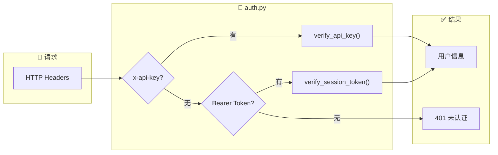
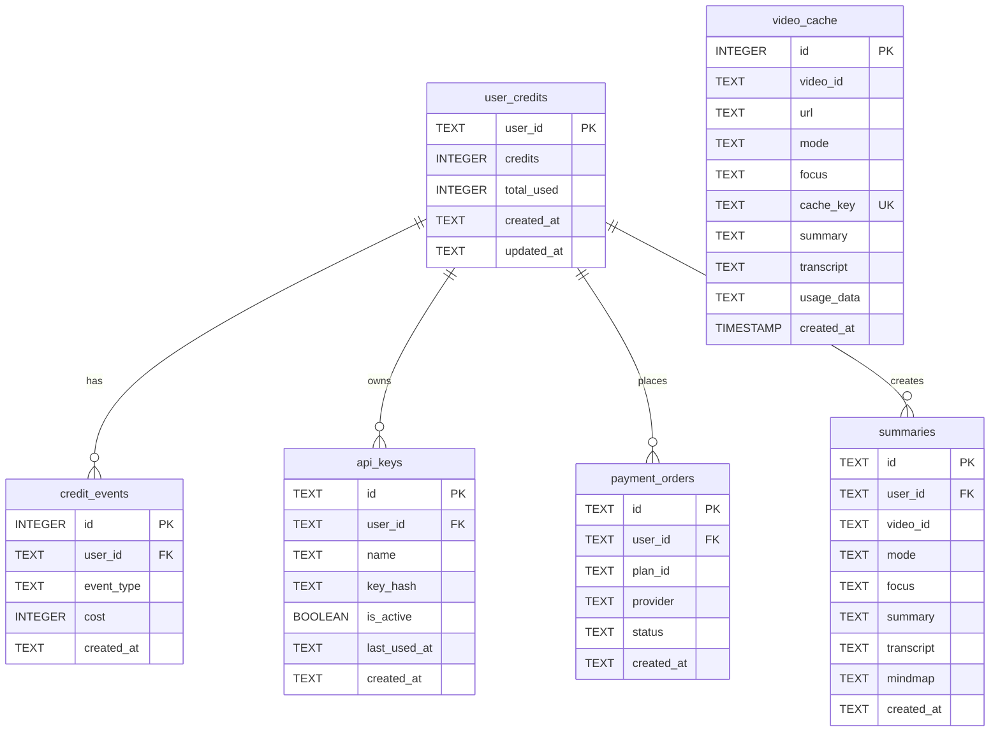
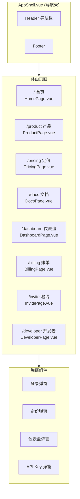
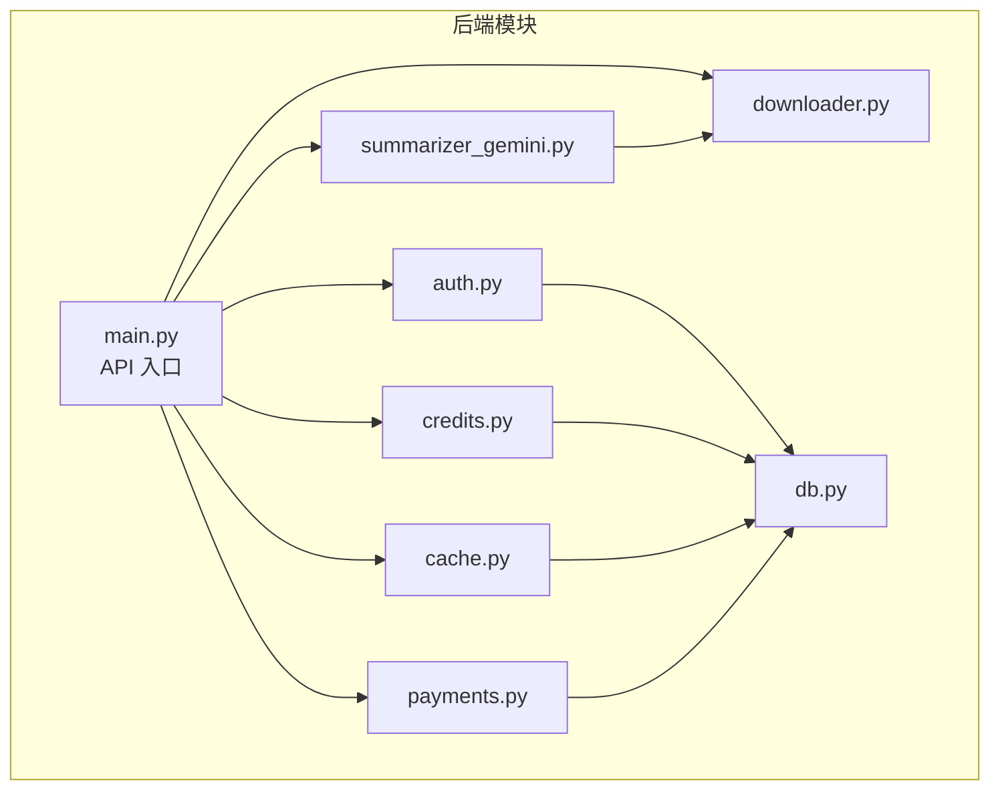

# Bili-Summarizer 项目结构图

> 生成日期: 2024-12-24

---

## 🏗️ 系统总览架构



---

## 📂 项目目录结构

```
bili-summarizer/
├── 📁 frontend/                    # Vue 3 前端应用
│   ├── 📁 src/
│   │   ├── App.vue                 # 主应用 (48KB, 总结核心逻辑)
│   │   ├── AppShell.vue            # 路由壳组件 (导航/弹窗)
│   │   ├── main.ts                 # 入口文件
│   │   ├── supabase.ts             # Supabase 客户端配置
│   │   ├── style.css               # 全局样式 (流光渐变主题)
│   │   │
│   │   ├── 📁 router/              # Vue Router
│   │   │   └── index.ts            # 8 条路由配置
│   │   │
│   │   ├── 📁 pages/               # 路由页面 (8个)
│   │   │   ├── HomePage.vue        # 首页 (总结入口)
│   │   │   ├── ProductPage.vue     # 产品介绍
│   │   │   ├── PricingPage.vue     # 定价方案
│   │   │   ├── DocsPage.vue        # 使用文档
│   │   │   ├── DashboardPage.vue   # 用户仪表盘
│   │   │   ├── BillingPage.vue     # 账单页面
│   │   │   ├── InvitePage.vue      # 邀请系统
│   │   │   └── DeveloperPage.vue   # 开发者 API
│   │   │
│   │   ├── 📁 components/          # UI 组件 (15个)
│   │   │   ├── UrlInputCard.vue    # URL 输入卡片
│   │   │   ├── SummaryCard.vue     # 总结卡片
│   │   │   ├── MindmapViewer.vue   # 思维导图
│   │   │   ├── TranscriptPanel.vue # 转录面板
│   │   │   ├── ChatPanel.vue       # AI 追问
│   │   │   ├── HistoryList.vue     # 历史列表
│   │   │   ├── ExportBar.vue       # 导出工具栏
│   │   │   ├── LoadingOverlay.vue  # 加载遮罩
│   │   │   ├── LoginModal.vue      # 登录弹窗
│   │   │   ├── PricingModal.vue    # 定价弹窗
│   │   │   ├── DashboardModal.vue  # 仪表盘弹窗
│   │   │   ├── BillingModal.vue    # 账单弹窗
│   │   │   ├── InviteModal.vue     # 邀请弹窗
│   │   │   ├── ApiKeyModal.vue     # API Key 弹窗
│   │   │   └── UsageGuideModal.vue # 使用指南
│   │   │
│   │   ├── 📁 composables/         # 组合式函数 (5个)
│   │   │   ├── useAuth.ts          # 认证逻辑
│   │   │   ├── useSummarize.ts     # 总结 SSE 逻辑
│   │   │   ├── useHistorySync.ts   # 云端历史同步
│   │   │   ├── useTheme.ts         # 主题切换
│   │   │   └── useReveal.ts        # 动画效果
│   │   │
│   │   └── 📁 types/               # TypeScript 类型
│   │       └── api.ts              # API 接口类型
│   │
│   ├── Dockerfile                  # 前端 Docker 镜像
│   ├── nginx.conf                  # Nginx 配置
│   └── vite.config.ts              # Vite 配置
│
├── 📁 web_app/                     # FastAPI 后端
│   ├── main.py                     # 核心 API (1857行, 64KB)
│   ├── auth.py                     # 鉴权模块
│   ├── credits.py                  # 积分系统
│   ├── cache.py                    # 缓存模块
│   ├── db.py                       # 数据库抽象层
│   ├── downloader.py               # yt-dlp 视频下载
│   ├── summarizer_gemini.py        # Gemini AI 调用
│   ├── payments.py                 # 支付处理
│   ├── ppt_generator.py            # PPT 生成
│   ├── history_sync_endpoints.py   # 历史同步 API
│   ├── telemetry.py                # 遥测日志
│   └── display.py                  # 显示工具
│
├── 📁 docs/                        # 项目文档 (14个)
│   ├── START_HERE.md               # 入口文档
│   ├── ARCHITECTURE.md             # 系统架构
│   ├── API_CONTRACT.md             # API 契约
│   ├── DATA_MODEL.md               # 数据模型
│   ├── PRODUCT_UI.md               # UI 规范
│   ├── COMMERCIAL.md               # 商业化
│   ├── CONFIGURATION.md            # 配置说明
│   ├── SECURITY_AUTH.md            # 安全认证
│   ├── RUNBOOK.md                  # 运维手册
│   └── ROADMAP.md                  # 路线图
│
├── 📁 scripts/                     # 工具脚本
├── docker-compose.yml              # 生产环境
├── docker-compose.dev.yml          # 开发环境
├── Dockerfile.backend              # 后端镜像
├── requirements.txt                # Python 依赖
└── AGENTS.md                       # 开发约束
```

---

## 🔄 核心业务流程

### 视频总结流程 (SSE)



---

## 🔐 认证与鉴权流程



**鉴权优先级**:
1. `x-api-key` (开发者 API)
2. `Authorization: Bearer <token>` (Supabase Session)

---

## 💾 数据模型



---

## 🌐 API 端点清单

### 核心业务

| 方法 | 路径 | 描述 | 鉴权 |
|------|------|------|------|
| `GET` | `/api/summarize` | SSE 视频总结 | ✅ |
| `POST` | `/api/chat` | AI 追问 | ✅ |
| `GET` | `/api/dashboard` | 用户仪表盘 | ✅ |
| `GET` | `/api/video-info` | 视频元信息 | ❌ |
| `GET` | `/api/image-proxy` | 图片代理 | ❌ |

### 历史与缓存

| 方法 | 路径 | 描述 | 鉴权 |
|------|------|------|------|
| `GET` | `/api/history` | 获取云端历史 | ✅ |
| `POST` | `/api/history` | 同步历史 | ✅ |
| `DELETE` | `/api/history/{id}` | 删除历史 | ✅ |
| `GET` | `/api/cache/stats` | 缓存统计 | ❌ |

### 支付与订阅

| 方法 | 路径 | 描述 | 鉴权 |
|------|------|------|------|
| `GET` | `/api/plans` | 获取套餐 | ❌ |
| `POST` | `/api/payments` | 创建支付 | ✅ |
| `GET` | `/api/payments/status` | 支付状态 | ✅ |
| `GET` | `/api/subscription` | 订阅状态 | ✅ |
| `GET` | `/api/billing` | 账单历史 | ✅ |

### 开发者 API

| 方法 | 路径 | 描述 | 鉴权 |
|------|------|------|------|
| `GET` | `/api/keys` | 列出 API Key | ✅ |
| `POST` | `/api/keys` | 创建 API Key | ✅ |
| `DELETE` | `/api/keys/{id}` | 删除 API Key | ✅ |

### 邀请与分享

| 方法 | 路径 | 描述 | 鉴权 |
|------|------|------|------|
| `GET` | `/api/invite` | 邀请信息 | ✅ |
| `POST` | `/api/invite/code` | 创建邀请码 | ✅ |
| `POST` | `/api/invite/redeem` | 兑换邀请码 | ✅ |
| `POST` | `/api/share` | 创建分享链接 | ✅ |
| `GET` | `/share/{id}` | 查看分享 | ❌ |

---

## 📱 前端路由结构



---

## ⚡ 技术栈总结

| 层级 | 技术 | 说明 |
|------|------|------|
| **前端框架** | Vue 3 + Composition API | SFC + TypeScript |
| **构建工具** | Vite | HMR 热更新 |
| **样式** | Tailwind CSS | 流光渐变主题 |
| **状态管理** | Pinia | 轻量级 |
| **路由** | Vue Router | 8 条路由 |
| **后端框架** | FastAPI | 异步 Python |
| **AI 模型** | Google Gemini 2.0 Flash | 视频理解 |
| **视频下载** | yt-dlp | B 站抓取 |
| **认证** | Supabase | OAuth + JWT |
| **数据库** | PostgreSQL / SQLite | 生产/开发 |
| **实时通信** | SSE | 进度推送 |
| **容器化** | Docker Compose | 一键部署 |

---

## 🔗 模块依赖关系



---

## 📊 文件规模统计

| 模块 | 文件数 | 最大文件 | 总代码量 |
|------|--------|----------|----------|
| **后端 web_app/** | 15 | main.py (64KB, 1857行) | ~100KB |
| **前端 pages/** | 8 | HomePage.vue (23KB) | ~45KB |
| **前端 components/** | 15 | PricingModal.vue (15KB) | ~80KB |
| **前端 composables/** | 5 | useSummarize.ts (9KB) | ~23KB |
| **文档 docs/** | 14 | - | ~17KB |
