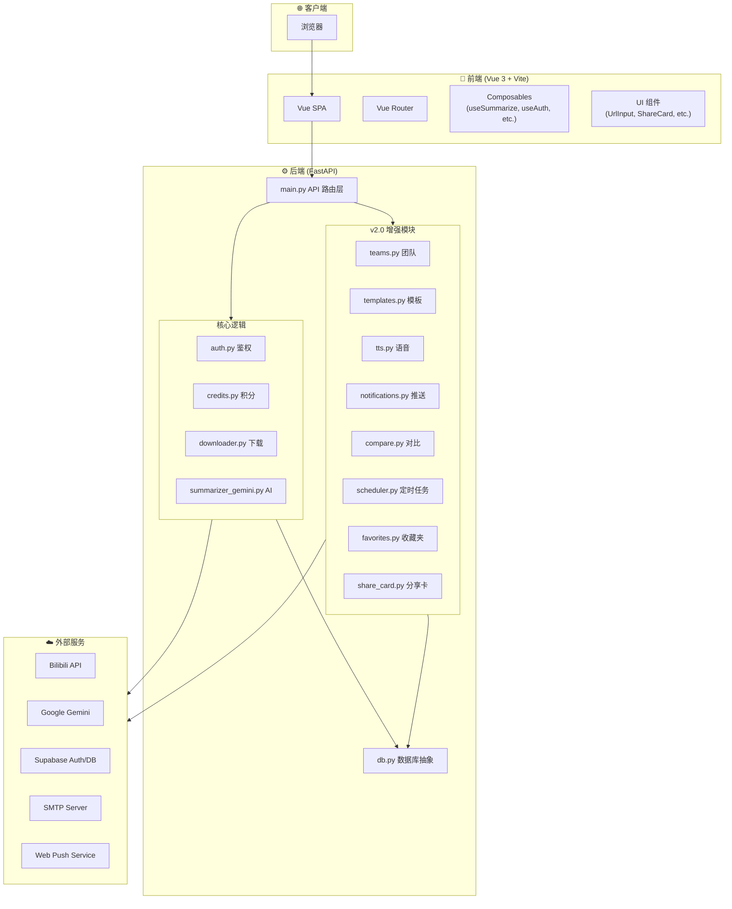
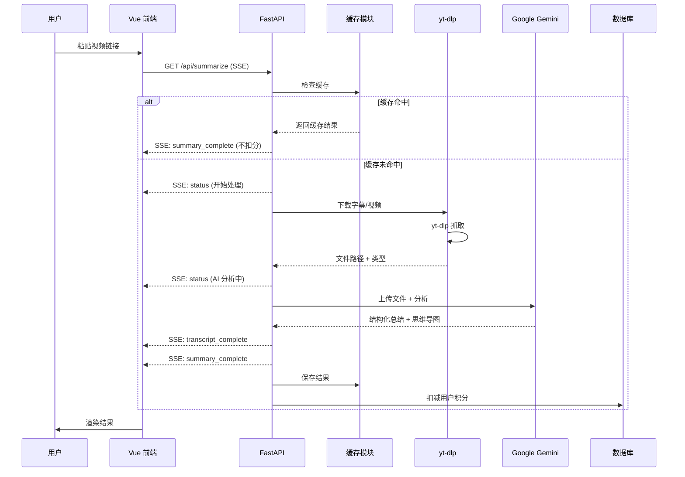
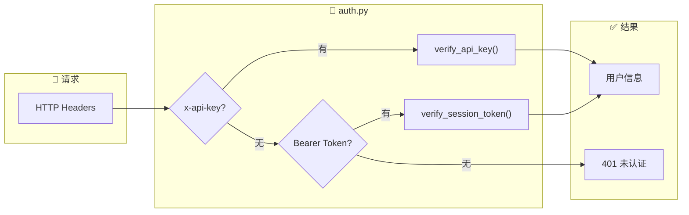
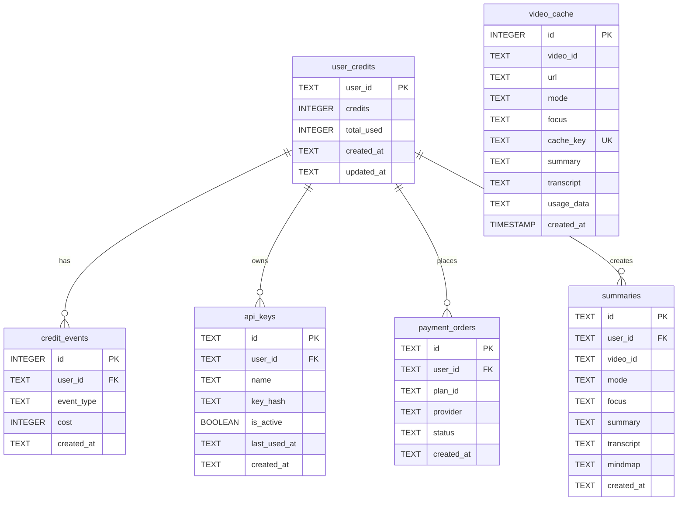
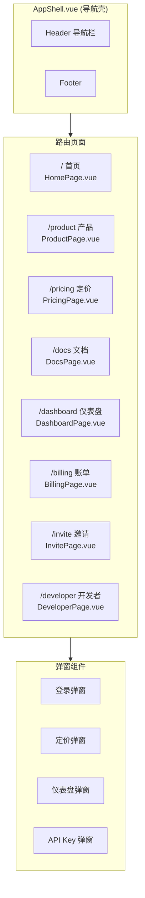
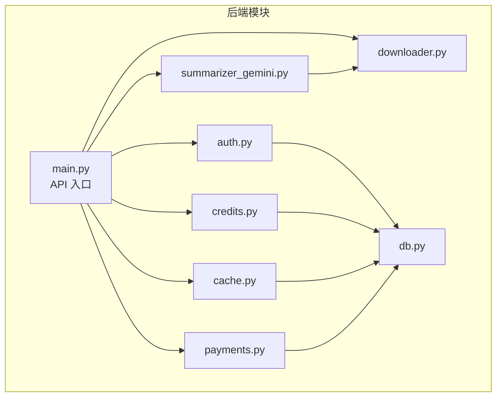

# Bili-Summarizer 项目结构图

> 生成日期: 2025-12-25

---

## 🏗️ 系统总览架构



---

## 📂 项目目录结构

```
bili-summarizer/
├── 📁 frontend/                    # Vue 3 前端应用
│   ├── 📁 src/
│   │   ├── App.vue                 # 主入口 (包含总结核心逻辑)
│   │   ├── 📁 pages/               # 路由页面 (12个)
│   │   │   ├── HomePage.vue        # 首页
│   │   │   ├── TeamsPage.vue       # [v2.0] 团队协作
│   │   │   ├── ComparePage.vue     # [v2.0] 总结对比
│   │   │   ├── TemplatesPage.vue   # [v2.0] 模板管理
│   │   │   ├── SubscriptionsPage.vue # [v2.0] UP主订阅
│   │   │   ├── DashboardPage.vue   # 仪表盘
│   │   │   └── ...
│   │   ├── 📁 components/          # UI 组件
│   │   │   ├── ShareCardModal.vue  # [v2.0] 分享卡片弹窗
│   │   │   ├── FavImportModal.vue  # [v2.0] 收藏夹导入弹窗
│   │   │   ├── AudioPlayer.vue     # [v2.0] 语音播放器
│   │   │   └── ...
│   │   └── ...
│   └── ...
│
├── 📁 web_app/                     # FastAPI 后端
│   ├── main.py                     # 核心 API 与路由 (2800+ 行)
│   ├── teams.py                    # [v2.0] 团队逻辑
│   ├── compare.py                  # [v2.0] 对比逻辑
│   ├── tts.py                      # [v2.0] 语音播报
│   ├── templates.py                # [v2.0] 模板管理
│   ├── subscriptions.py            # [v2.0] 订阅管理
│   ├── notifications.py            # [v2.0] 通知推送
│   ├── scheduler.py                # [v2.0] 任务调度
│   ├── share_card.py               # [v2.0] 卡片渲染
│   ├── favorites.py                # [v2.0] 收藏夹解析
│   ├── auth.py                     # 鉴权
│   ├── db.py                       # 数据库
│   └── ...
│
├── 📁 docs/                        # 项目文档
├── 📁 videos/                      # 临时视频缓存
├── 📁 feedback/                    # 用户反馈
└── ...
```


---

## 🔄 核心业务流程

### 视频总结流程 (SSE)



---

## 🔐 认证与鉴权流程



**鉴权优先级**:
1. `x-api-key` (开发者 API)
2. `Authorization: Bearer <token>` (Supabase Session)

---

## 💾 数据模型



---

## 🌐 API 端点清单

### 核心业务

| 方法 | 路径 | 描述 | 鉴权 |
|------|------|------|------|
| `GET` | `/api/summarize` | SSE 视频总结 | ✅ |
| `POST` | `/api/chat` | AI 追问 | ✅ |
| `GET` | `/api/dashboard` | 用户仪表盘 | ✅ |
| `GET` | `/api/video-info` | 视频元信息 | ❌ |
| `GET` | `/api/image-proxy` | 图片代理 | ❌ |

### 历史与缓存

| 方法 | 路径 | 描述 | 鉴权 |
|------|------|------|------|
| `GET` | `/api/history` | 获取云端历史 | ✅ |
| `POST` | `/api/history` | 同步历史 | ✅ |
| `DELETE` | `/api/history/{id}` | 删除历史 | ✅ |
| `GET` | `/api/cache/stats` | 缓存统计 | ❌ |

### 支付与订阅

| 方法 | 路径 | 描述 | 鉴权 |
|------|------|------|------|
| `GET` | `/api/plans` | 获取套餐 | ❌ |
| `POST` | `/api/payments` | 创建支付 | ✅ |
| `GET` | `/api/payments/status` | 支付状态 | ✅ |
| `GET` | `/api/subscription` | 订阅状态 | ✅ |
| `GET` | `/api/billing` | 账单历史 | ✅ |

### 开发者 API

| 方法 | 路径 | 描述 | 鉴权 |
|------|------|------|------|
| `GET` | `/api/keys` | 列出 API Key | ✅ |
| `POST` | `/api/keys` | 创建 API Key | ✅ |
| `DELETE` | `/api/keys/{id}` | 删除 API Key | ✅ |

### 邀请与分享

| 方法 | 路径 | 描述 | 鉴权 |
|------|------|------|------|
| `GET` | `/api/invite` | 邀请信息 | ✅ |
| `POST` | `/api/invite/code` | 创建邀请码 | ✅ |
| `POST` | `/api/invite/redeem` | 兑换邀请码 | ✅ |
| `POST` | `/api/share` | 创建分享链接 | ✅ |
| `GET` | `/share/{id}` | 查看分享 | ❌ |

---

## 📱 前端路由结构



---

## ⚡ 技术栈总结

| 层级 | 技术 | 说明 |
|------|------|------|
| **前端框架** | Vue 3 + Composition API | SFC + TypeScript |
| **构建工具** | Vite | HMR 热更新 |
| **样式** | Tailwind CSS | 流光渐变主题 |
| **状态管理** | Pinia | 轻量级 |
| **路由** | Vue Router | 8 条路由 |
| **后端框架** | FastAPI | 异步 Python |
| **AI 模型** | Google Gemini 2.0 Flash | 视频理解 |
| **视频下载** | yt-dlp | B 站抓取 |
| **认证** | Supabase | OAuth + JWT |
| **数据库** | PostgreSQL / SQLite | 生产/开发 |
| **实时通信** | SSE | 进度推送 |
| **容器化** | Docker Compose | 一键部署 |

---

## 🔗 模块依赖关系



---

## 📊 文件规模统计

| 模块 | 文件数 | 最大文件 | 总代码量 |
|------|--------|----------|----------|
| **后端 web_app/** | 15 | main.py (64KB, 1857行) | ~100KB |
| **前端 pages/** | 8 | HomePage.vue (23KB) | ~45KB |
| **前端 components/** | 15 | PricingModal.vue (15KB) | ~80KB |
| **前端 composables/** | 5 | useSummarize.ts (9KB) | ~23KB |
| **文档 docs/** | 14 | - | ~17KB |
