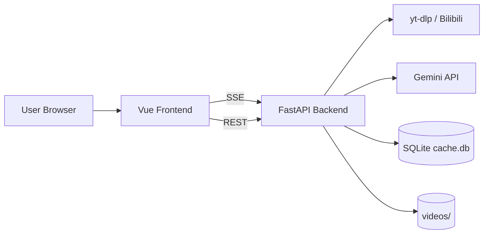
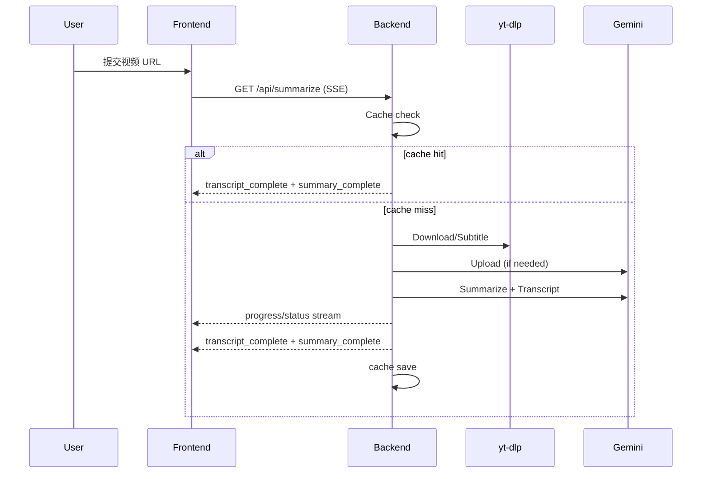
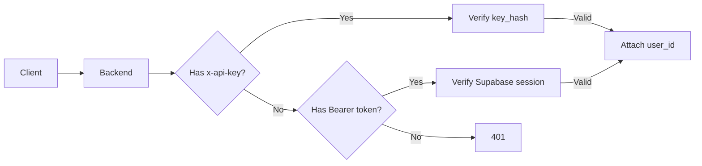
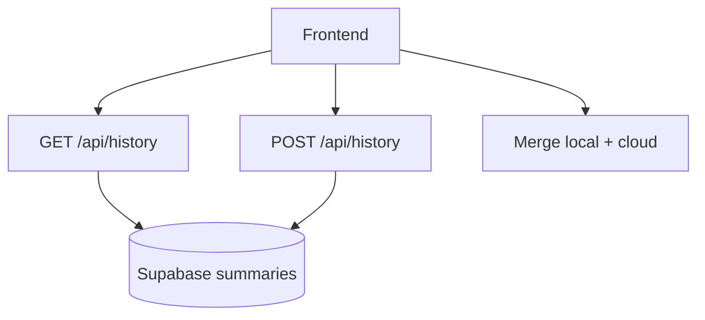

# Architecture

This document describes the system architecture, data flow, and deployment topology for Bili‑Summarizer.

## 1) System Components


## 2) Core Data Flow (Summarize)


## 3) Auth & API Key


## 4) Cloud History Sync


## 5) Deployment Topology

### Local Dev (Vite + Uvicorn)
```
Browser -> http://localhost:5173 (Vite)
Vite proxy -> http://localhost:7860 (FastAPI)
```

### Docker Compose
```
Browser -> Nginx (frontend)
Nginx -> FastAPI (backend)
FastAPI -> Gemini / yt-dlp / cache.db / videos/
```

### Render (Single Service)
```
Browser -> FastAPI (serves /api + SPA from frontend/dist)
FastAPI -> Gemini / yt-dlp / cache.db / videos/
```

## 6) Storage
- `cache.db`: summary/transcript cache + API keys + usage_daily.
- `videos/`: downloaded media for playback.
- Supabase: cloud history (optional).

## 7) Legacy UI
If `frontend/dist` is missing, backend serves `web_app/legacy_ui/index.html` and `web_app/legacy_ui/static/`.
