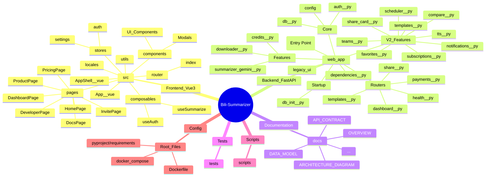
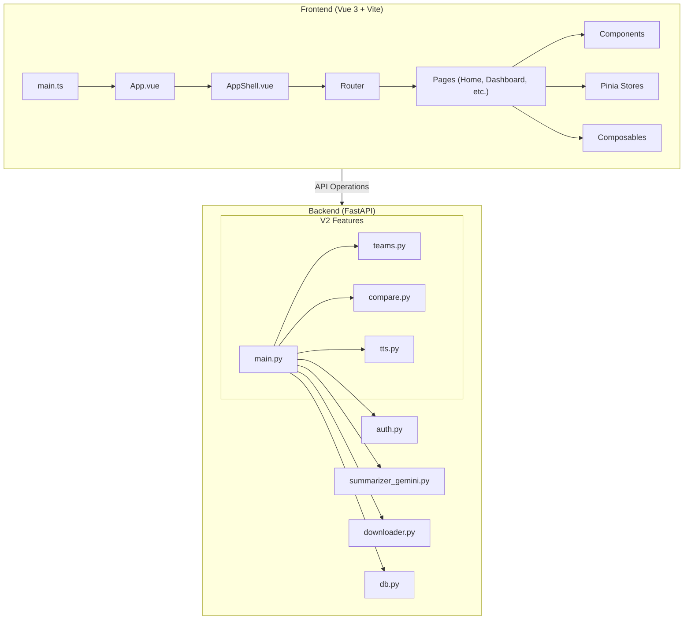

# Project Structure Diagram

Generated based on current filesystem state and documentation review.

```mermaid
mindmap
  root((Bili-Summarizer))
    Frontend_Vue3
      src
        App__vue
        AppShell__vue
        pages
          HomePage
          DashboardPage
          ProductPage
          PricingPage
          DocsPage
          InvitePage
          DeveloperPage
        components
          UI_Components
          Modals
        composables
          useSummarize
          useAuth
        stores
          auth
          settings
        router
          index
        utils
        locales
    Backend_FastAPI
      web_app
        main__py(Entry Point)
        Routers
          health__py
          dashboard__py
          templates__py
          share__py
          payments__py
        Startup
          db_init__py
        dependencies__py
        Core
          auth__py
          db__py
          config
        Features
          summarizer_gemini__py
          downloader__py
          credits__py
        V2_Features
          teams__py
          compare__py
          tts__py
          templates__py
          favorites__py
          share_card__py
          subscriptions__py
          notifications__py
          scheduler__py
        legacy_ui
    Documentation
      docs
        ARCHITECTURE_DIAGRAM
        OVERVIEW
        API_CONTRACT
        DATA_MODEL
        ...
    Tests
      tests
    Scripts
      scripts
    Config
      Root_Files
        Dockerfile
        docker_compose
        pyproject/requirements
```

## Detailed Component View

```mermaid
graph TD
    subgraph Frontend["Frontend (Vue 3 + Vite)"]
        F_Entry["main.ts"] --> F_App["App.vue"]
        F_App --> F_Shell["AppShell.vue"]
        F_Shell --> F_Router["Router"]
        F_Router --> F_Pages["Pages (Home, Dashboard, etc.)"]
        F_Pages --> F_Comps["Components"]
        F_Pages --> F_Stores["Pinia Stores"]
        F_Pages --> F_Composables["Composables"]
    end

    subgraph Backend["Backend (FastAPI)"]
        B_Main["main.py"] --> B_Auth["auth.py"]
        B_Main --> B_Summarizer["summarizer_gemini.py"]
        B_Main --> B_Downloader["downloader.py"]
        B_Main --> B_DB["db.py"]
        
        subgraph V2["V2 Features"]
            B_Main --> B_Teams["teams.py"]
            B_Main --> B_Compare["compare.py"]
            B_Main --> B_TTS["tts.py"]
        end
    end

    Frontend -->|API Operations| Backend
```
