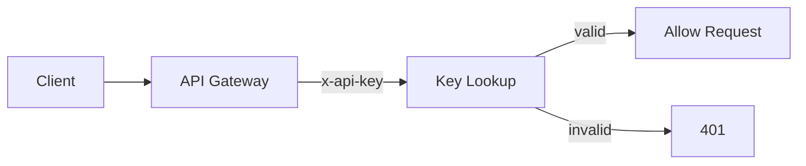
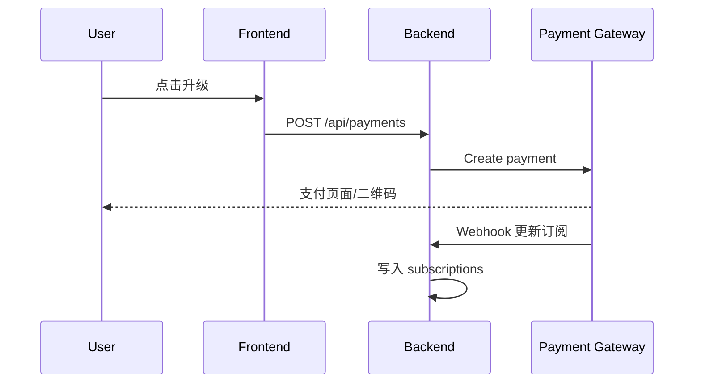
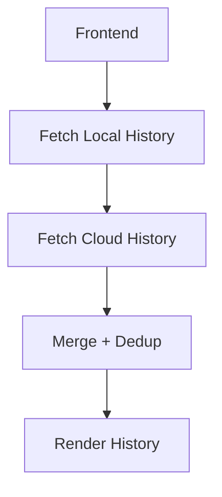

# Feature Roadmap

本文档覆盖 Phase 8-10 的产品规划、用户故事、技术方案、数据库设计、时序/流程图和优先级矩阵。

## 概览
Phase 8: 商业化基础（API Key + 订阅）  
Phase 9: 核心增强（批量总结 + 云端同步 + PDF）  
Phase 10: 生态拓展（浏览器插件 + AI 追问）

---

## Phase 8: 商业化基础 (API Key + 订阅)

### 功能 1: API Key
**用户故事**
- 作为开发者，我希望创建 API Key 以便在自己的应用中调用总结能力。
- 作为管理员，我希望能够撤销某个 Key 并查看其使用情况。

**技术方案**
- 后端新增 API Key 管理表，暴露 `/api/keys` CRUD。
- 请求鉴权支持两种方式：登录态（Bearer token）或 API Key（`x-api-key`），两者至少满足其一，否则返回 401。
- API Key 需要哈希存储，返回明文仅一次。

**代码示例**
```python
# web_app/auth.py
from fastapi import Header, HTTPException

async def require_api_key(x_api_key: str = Header(default="")):
    if not x_api_key:
        raise HTTPException(status_code=401, detail="Missing API Key")
    # lookup hashed key -> user_id
```

**数据库设计 (SQL)**
```sql
CREATE TABLE api_keys (
  id TEXT PRIMARY KEY,
  user_id TEXT NOT NULL,
  name TEXT NOT NULL,
  prefix TEXT NOT NULL,
  key_hash TEXT NOT NULL,
  is_active INTEGER NOT NULL DEFAULT 1,
  created_at TIMESTAMP DEFAULT CURRENT_TIMESTAMP,
  last_used_at TIMESTAMP
);

CREATE INDEX idx_api_keys_user ON api_keys(user_id);
```

**流程图**


---

### 功能 2: 订阅与额度
**用户故事**
- 作为用户，我希望升级 Pro 获取更高额度。
- 作为系统，我需要在调用前校验额度与订阅状态。

**技术方案**
- 支付宝/微信支付 + Webhook 回调同步订阅状态。
- 在总结入口处执行额度校验（免费每日 3 次，Pro 不限或更高）。
- 记录每日次数：优先用 DB，若引入 Redis 需补部署与持久化策略。

**代码示例**
```python
def can_summarize(user_id: str) -> bool:
    plan = get_user_plan(user_id)
    if plan == "pro":
        return True
    return get_daily_usage(user_id) < 3
```

**数据库设计 (SQL)**
```sql
CREATE TABLE subscriptions (
  user_id TEXT PRIMARY KEY,
  plan TEXT NOT NULL,
  status TEXT NOT NULL,
  current_period_end TIMESTAMP,
  updated_at TIMESTAMP DEFAULT CURRENT_TIMESTAMP
);

CREATE TABLE usage_daily (
  user_id TEXT NOT NULL,
  date TEXT NOT NULL,
  count INTEGER NOT NULL DEFAULT 0,
  PRIMARY KEY (user_id, date)
);
```

**时序图**


---

## Phase 9: 核心增强 (批量总结 + 云端同步 + PDF)

### 功能 3: 批量总结
**用户故事**
- 作为用户，我希望一次提交多个链接并查看整体进度。

**技术方案**
- 后端批量任务队列（Celery/RQ/BackgroundTask）。
- 若使用 Render 单进程服务，需要单独 worker 服务或改为轻量队列。
- 前端聚合状态与列表结果。

**数据库设计 (SQL)**
```sql
CREATE TABLE batch_jobs (
  id TEXT PRIMARY KEY,
  user_id TEXT NOT NULL,
  status TEXT NOT NULL,
  created_at TIMESTAMP DEFAULT CURRENT_TIMESTAMP
);

CREATE TABLE batch_items (
  id TEXT PRIMARY KEY,
  job_id TEXT NOT NULL,
  url TEXT NOT NULL,
  status TEXT NOT NULL,
  summary TEXT,
  transcript TEXT
);
```

---

### 功能 4: 云端同步
**用户故事**
- 作为用户，我希望跨设备查看历史记录。

**技术方案**
- Supabase 或 Postgres 存储历史。
- 前端登录后同步历史并合并本地缓存。
- 去重策略建议使用 `url + mode + focus` 或 hash 作为唯一键。

**流程图**


---

### 功能 5: PDF 导出
**用户故事**
- 作为用户，我希望一键导出带样式的总结 PDF。

**技术方案**
- 前端 `html2pdf`/`jspdf` 生成，保持当前摘要样式。
- Mermaid/外链图片需转为 data URL，避免导出时跨域失败。

---

## Phase 10: 生态拓展 (浏览器插件 + AI 追问)

### 功能 6: 浏览器插件
**用户故事**
- 作为用户，我希望在 B 站页面一键触发总结。

**技术方案**
- 插件注入按钮，调用后端 API。
- 复用现有 SSE 接口。

---

### 功能 7: AI 追问
**用户故事**
- 作为用户，我希望基于摘要继续提问。

**技术方案**
- 前端收集问题，后端 `/chat` 接口调用 Gemini。
- 需要摘要作为上下文。

---

## 优先级矩阵（价值 x 成本）
```
高价值 / 低成本: API Key、PDF 导出
高价值 / 高成本: 订阅系统、浏览器插件
中价值 / 低成本: 云端历史
中价值 / 高成本: 批量总结
```

---

## 实施顺序建议
| 序 | 功能 | 预估时间 | 理由 |
|---|---|---:|---|
| 1 | 恢复 API Key | 1h | 低复杂度，修复现有代码 |
| 2 | AI 追问 | 3h | 高价值，用户强需求 |
| 3 | 云端历史 | 2h | Supabase 已配置 |
| 4 | PDF 导出 | 1h | 前端即可完成 |
| 5 | 批量总结 | 3h | 后端框架已存在 |
| 6 | 订阅系统 | 4h | 需支付回调签名校验 |
| 7 | 浏览器插件 | 5h | 独立项目 |
