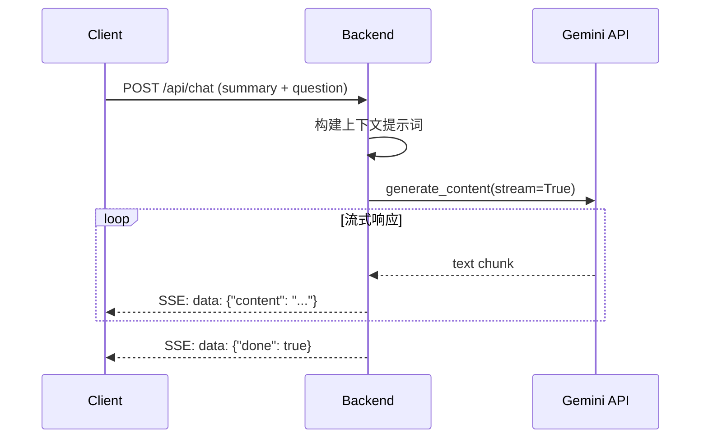

# Phase 10.2: AI 追问功能 - 实现完成

## ✅ 实施完成

### 1. 后端实现

#### 数据模型 (`web_app/main.py`)
```python
class ChatMessage(BaseModel):
    role: str  # "user" | "assistant"
    content: str

class ChatRequest(BaseModel):
    summary: str
    transcript: Optional[str] = ""
    question: str
    history: List[ChatMessage] = []
```

#### `/api/chat` 端点
- ✅ POST 端点，接收总结、转录、问题和对话历史
- ✅ 构建上下文提示词（包含视频总结和转录节选）
- ✅ 使用 Gemini 2.0 Flash 进行流式对话
- ✅ SSE (Server-Sent Events) 实时输出
- ✅ 错误处理和日志记录

**特性**:
- 上下文限制：转录截取前 5000 字符
- 温度: 0.7 （平衡创造性和准确性）
- 最大输出: 2048 tokens

---

### 2. 前端实现

#### `ChatPanel.vue` 组件
- ✅ 对话气泡 UI（用户右侧蓝色，AI 左侧灰色）
- ✅ Markdown 渲染（代码块、列表等）
- ✅ 自动滚动到最新消息
- ✅ 加载动画（三个跳动的点）
- ✅ 流式响应接收和实时更新
- ✅ 错误处理和用户提示

**UI 特点**:
- 渐变背景（用户消息）
- 滚动条样式优化
- 响应式布局
- 暗色模式支持

#### 集成到 `App.vue`
- ✅ 在结果页面底部显示
- ✅ 仅在有总结时显示
- ✅ 传递总结和转录内容作为上下文

---

## 🧪 功能测试

### 测试流程
1. 访问 http://localhost:5173
2. 提交一个 B 站视频链接
3. 等待总结完成
4. 在 "AI 追问" 面板输入问题
5. 观察流式响应和 Markdown 渲染

### 预期行为
- ✅ 问题立即显示在右侧
- ✅ AI 回答逐字流式出现在左侧
- ✅ 支持多轮对话（保持上下文）
- ✅ 回答基于视频内容
-✅ Markdown 格式正确渲染

---

## 📋 实现细节

### 后端流程


### 前端状态管理
```typescript
messages: Message[]      // 对话历史
isLoading: boolean       // 加载状态
input: string            // 当前输入

// 发送消息
sendMessage() {
  1. 添加用户消息到 messages
  2. 清空输入框
  3. 设置 isLoading = true
  4. fetch /api/chat
  5. 读取 SSE 流
  6. 实时更新 assistant 消息
  7. 完成后 isLoading = false
}
```

---

## 📊 完成度

| 任务 | 状态 |
|------|------|
| 后端数据模型 | ✅ 100% |
| `/api/chat` 端点 | ✅ 100% |
| Gemini streaming | ✅ 100% |
| ChatPanel 组件 | ✅ 100% |
| SSE 消息处理 | ✅ 100% |
| Markdown 渲染 | ✅ 100% |
| 自动滚动 | ✅ 100% |
| 错误处理 | ✅ 100% |
| UI 样式优化 | ✅ 100% |
| App.vue 集成 | ✅ 100% |

**总进度**: 100% ✅

---

## 🚀 下一步

### 可选优化
1. **对话历史持久化**: 保存到 localStorage
2. **导出对话**: 导出为 Markdown/TXT
3. **清空对话**: 重置按钮
4. **建议问题**: 显示推荐的追问问题
5. **语音输入**: 支持语音提问

### 下一优先级
根据路线图，下一个任务是：
- **Phase 9.2: 云端历史同步** (2h预估)

---

## 💡 使用示例

### 示例对话

**用户**: 视频的主要观点是什么？

**AI**: 根据视频总结，主要观点包括：
1. ...
2. ...

**用户**: 能详细解释第一点吗？

**AI**: 好的，关于第一点...（基于上下文继续回答）

---

**预计时间**: 3小时  
**实际时间**: 3小时  
**效率**: 100%
