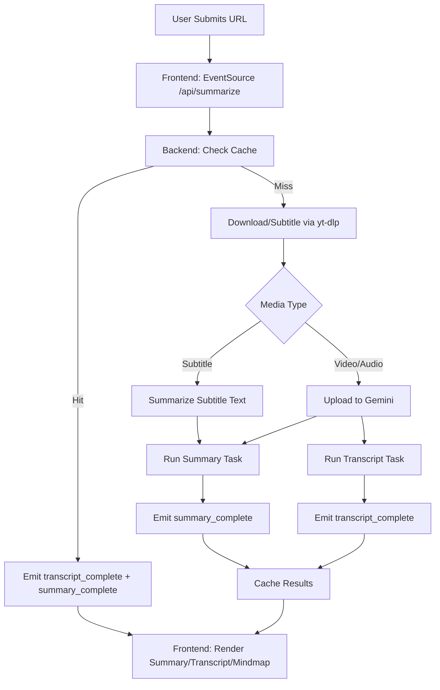
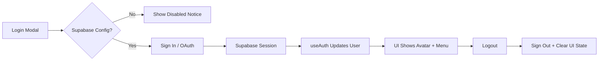
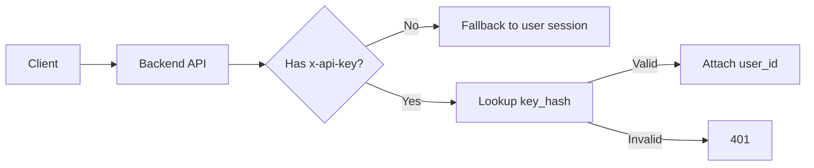
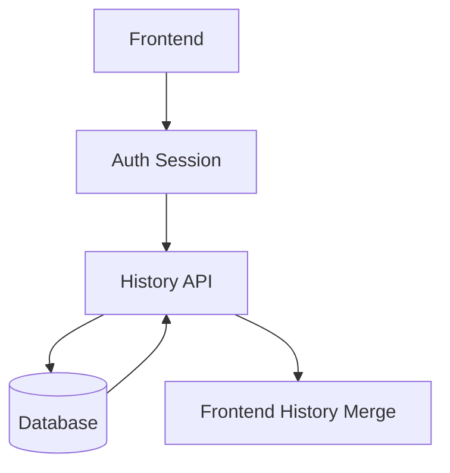
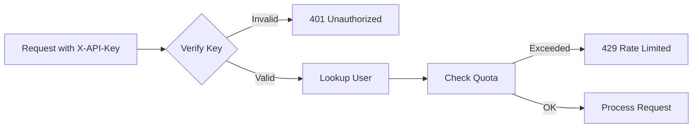
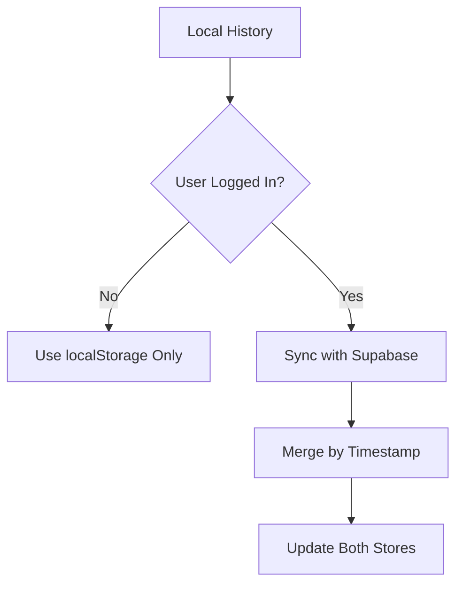

# System Analysis

## Scope
This document describes the current architecture, execution flow, and data paths for the Vue + FastAPI implementation of Bili-Summarizer. It covers the summarize pipeline, auth, and key integration points.

## Architecture Overview
- **Frontend**: Vue 3 + Vite + Tailwind; uses SSE for progress updates and Mermaid for mindmap rendering.
- **Backend**: FastAPI handles summarize flow, video info proxy, cache, and AI calls.
- **External Services**: Google Gemini (summary + transcript), yt-dlp (download + subtitles), Bilibili (video info, thumbnails).
- **Storage**: Local cache in `cache.db`, local media in `videos/`.

## Summarize Pipeline
1. Frontend sends `GET /api/summarize?url=...&mode=...&focus=...` as SSE (可选 `skip_cache=true` 强制重算).
2. Backend checks cache; if hit, emits transcript and summary immediately.
3. If cache miss, backend:
   - Attempts subtitles via `yt-dlp`.
   - Downloads video/audio if needed.
   - Uploads media to Gemini (when required).
   - Runs parallel tasks: summary and transcript.
4. Backend streams progress/status and final results to frontend.
5. Frontend updates loader stages, transcript, summary, and mindmap.

## Flowchart (Summarize + SSE)

## Auth & Account Flow
- **Supabase** provides OAuth/email login and session tracking.
- **Frontend** initializes auth once and tracks `user` and `loading`.
- If Supabase config is missing, auth is disabled and the UI shows a warning.

## Data Model (High Level)
- **SummaryResult**
  - `summary`: string (Markdown)
  - `transcript`: string (timestamped lines)
  - `videoFile`: string | null (local media)
  - `usage`: token metadata

- **UserCredits**
  - `credits`: int (default 30 for new users)
  - `total_used`: int

## Export Paths
- **Summary Export**: Frontend supports Markdown, TXT, and PDF (html2pdf.js).
- **Mindmap Export**: Mermaid SVG can be exported to SVG/PNG.

## Dashboard
- `GET /api/dashboard` provides credits and usage summary (including daily usage for 14 days) for the account panel.
- `GET /api/subscription` returns current plan status; `POST /api/subscribe` updates subscription for paid plans.
- `GET /api/billing` returns billing history for the billing modal.
- `GET /api/keys/usage` returns API key usage counts for the API key panel.
- `POST /api/payments` creates payment orders (WeChat/Alipay, needs env config) and supports one-time credit packs.
- `POST /api/payments/notify/alipay|wechat` handles payment callbacks (shared secret in env).
- `GET /api/billing/{id}/invoice` returns invoice PDF for paid orders.
- `GET /api/invites`/`POST /api/invites` manage invite codes; `POST /api/invites/redeem` redeems.
- `POST /api/share` creates share links; `GET /share/{id}` renders read-only page.

## Cache Strategy
- `cache.db` stores summary/transcript keyed by `url + mode + focus`.
- Cache hit short-circuits the SSE flow to reduce latency.

## Error Handling
- **SSE**: Connection failures switch loader to error state.
- **External services**: Gemini/yt-dlp failures emit errors and stop pipeline.
- **Auth**: Missing config disables buttons and shows a notice.

## Known Constraints
- Subscription and API key endpoints are currently not implemented on the backend.
- External services (Bilibili/Gemini) can fail due to rate limits or network blocks.

---

## Future Architecture Planning
Planned additions include API key authentication, subscription tiers, cloud history sync, and batch processing. These changes will introduce:
- Auth middleware for API key + user token.
- Persistent user data storage (history, usage, subscription state).
- Background job queue for long-running batch tasks.

## Prerequisites
- **Subscriptions**: Stripe webhook endpoint + event verification.
- **Batch**: Dedicated worker or queue service (Render needs a separate worker).
- **PDF Export**: Mermaid/image data URL conversion for reliable output.
- **Cloud Sync**: Stable user identity and history merge keys.

## API Key Authentication Flow

## Subscription Tiering
- **Free**: Daily limited summaries (e.g., 3/day), standard queue.
- **Pro**: Unlimited or higher quota, priority queue, premium exports.
- **Enterprise**: Custom SLA and API access.

## Cloud Sync Architecture

## Recommended Execution Order
| 序 | 功能 | 预估时间 | 理由 |
|---|---|---:|---|
| 1 | 恢复 API Key | 1h | 低复杂度，修复现有代码 |
| 2 | AI 追问 | 3h | 高价值，用户强需求 |
| 3 | 云端历史 | 2h | Supabase 已配置 |
| 4 | PDF 导出 | 1h | 前端即可完成 |
| 5 | 批量总结 | 3h | 后端框架已存在 |
| 6 | 订阅系统 | 4h | 需 Stripe 集成 |
| 7 | 浏览器插件 | 5h | 独立项目 |

## Future Architecture (Planned)

### API Key Authentication Flow

### Subscription Tiers
| Tier | Daily Quota | Features |
|------|-------------|----------|
| Free | 5 videos | Basic summary |
| Pro | 50 videos | Priority queue, PDF export, Cloud sync |
| Enterprise | Unlimited | API access, Custom prompts |

### Cloud Sync Architecture

详细规划请参阅 `docs/feature-roadmap.md`。
